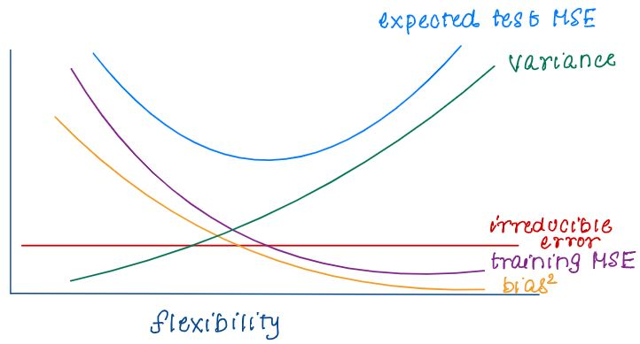

```{r setup, include=FALSE}
knitr::opts_chunk$set(echo = TRUE)
```

## 1. Bias Variance Tradeoff

### Definition of bias and variance in mathematical terms
* Bias($\hat{f}(x_{0})$) = E($f(x_{0}) - \hat{f}(x_0)$)
* Var($\hat{f}(x_{0})$) = E($\hat{f}(x_{0})$ - E($\hat{f}(x_{0})$)))$^2$

### Definition of bias and variance in conceptual terms (plain language)
* Bias refers to the error that is introduced by approximating our real-life phenomenon
* Variance refers to the amount by which our model would change if we had estimated it using a different training set

### How bias and variance behaves in supervised learning methods
* In supervised learning, there's a tradeoff between bias and variance. As you increase the complexity of the model, bias decreases but variance increases, and vice versa. The challenge is finding the right balance to minimize overall prediction error
* more flexible methods --> higher varaince and lower bias
* the expected test MSE is never < irreducible error
* expected test MSE = var + bias$^{2}$ + irreducible error
* E($y_0 - \hat{f}(x_0)$)$^2$ = Var($\hat{f}(x_{0})$) + [Bias($\hat{f}(x_{0})$)]$^2$ + Var($\epsilon$)
    

### Calculate bias (square) and variance for simulated data
* Midterm 1, Question 2
    ```{r, echo=TRUE}
    set.seed(1) # generate 100 observations from the true regression model
    n = 100
    x = runif(n, min = 0, max = 2) 
    error = rnorm(n,0,1)
    y = 4 + x + x^2 + x^3 + error
    train_set = data.frame(x,y)

    M1 = lm(y~x,data=train_set)
    M2 = lm(y~poly(x,degree=2),data=train_set)
    M3 = lm(y~poly(x,degree=3),data=train_set)
    M4 = lm(y~poly(x,degree=5),data=train_set)
    M5 = lm(y~poly(x,degree=11),data=train_set)

    ######### Problem 2.1 ###########
    # simulate 1000 training sets
    # for each of these 1000 training sets, train M1-M5
    # store the predicted values fhat(x_0) when x = 0.9
    # report the first 5 predicted values for each model
    set.seed(1)
    pred1 = pred2 = pred3 = pred4 = pred5 = rep(NA,1000)

    for (i in 1:1000){
      error=rnorm(n,0,1) 
      y=4+x+x^2+x^3 + error
      train_set = data.frame(x,y)
      
      M1 = lm(y~x,data=train_set)
      M2 = lm(y~poly(x,degree=2),data=train_set)
      M3 = lm(y~poly(x,degree=3),data=train_set)
      M4 = lm(y~poly(x,degree=5),data=train_set)
      M5 = lm(y~poly(x,degree=11),data=train_set)
      
      pred1[i] = predict(M1,newdata=data.frame(x=.9))
      pred2[i] = predict(M2,newdata=data.frame(x=.9))
      pred3[i] = predict(M3,newdata=data.frame(x=.9))
      pred4[i] = predict(M4,newdata=data.frame(x=.9))
      pred5[i] = predict(M5,newdata=data.frame(x=.9))
    }
    pred1[1:5]
    pred2[1:5]
    pred3[1:5]
    pred4[1:5]
    pred5[1:5]

    ######### Problem 2.2 ###########
    # use results from above to get Bias(fhat(x_0))^2 for each     model when x_0 = 0.9
    x0=.9
    true_y = 4+(x0)+(x0)^2+(x0)^3
    bias1 = (mean(pred1)-true_y)^2
    bias2 = (mean(pred2)-true_y)^2
    bias3 = (mean(pred3)-true_y)^2
    bias4 = (mean(pred4)-true_y)^2
    bias5 = (mean(pred5)-true_y)^2
    biases = c(bias1, bias2, bias3, bias4, bias5)
    #plot(biases)

    ######### Problem 2.3 ###########
    # use results from above to get Var(fhat(x_0)) for each model when x_0 = 0.9
    x0=.9
    true_y = 4+(x0)+(x0)^2+(x0)^3
    var1 = mean((pred1-mean(pred1))^2)
    var2 = mean((pred2-mean(pred2))^2)
    var3 = mean((pred3-mean(pred3))^2)
    var4 = mean((pred4-mean(pred4))^2)
    var5 = mean((pred5-mean(pred5))^2)
    vars = c(var1, var2, var3, var4, var5)
    #plot(vars)

    ######### Problem 2.5 ###########
    # get all five models expected test MSE
    (bias1) + var1 + 1
    (bias2) + var2 + 1
    (bias3) + var3 + 1
    (bias4) + var4 + 1
    (bias5) + var5 + 1

    ######### Problem 2.7 ###########
    # estimate of the irreducible error for the models
    (1/(100-(1+1)))*sum((true_y-pred1)^2)
    (1/(100-(1+1)))*sum((true_y-pred2)^2)
    (1/(100-(1+1)))*sum((true_y-pred3)^2)
    (1/(100-(1+1)))*sum((true_y-pred4)^2)
    (1/(100-(1+1)))*sum((true_y-pred5)^2)

    ```

## 2. Multiple Linear Regression

### Setup the model. Estimate parameters in this model (mathematically and conceptually)
* to find the estimate for $\hat{\beta}$
    + find the $\hat{\beta}$'s that minimize the RSS (residual sum of squares)
* To estimate the parameters (B coefficients), the least squares method is used. 
    + The goal is to minimize the sum of squared differences between the observed and predicted values.
    + $\sum_{i=1}^{n} (y_i - (\hat{\beta_0} + \hat{\beta_1}X_{i1} + ...))^2$
    + interpretation of least squares coefficient
        + $\hat{Y} = \hat{\beta_0} + \hat{\beta_1}X_1 + ...$
            + $\hat{\beta_j}$ can be interpreted as the average change in Y associated with a 1 unit change in $X_j$, holding all other predictors constant
    + the estimates are good in the least square estimates $\hat{\beta}$ are unbiased
        + idea: obtain huge number of beta hats from many training data sets, then the average of them would exactly = B
        + refer to HW2 Q1
            
    ```{r, echo=TRUE}
    X1 = seq(0,10,length.out =100) #generates 100 equally spaced values from 0 to 10.
    X2 = runif(100) #generates 100 uniform values.
    n = 100
    beta_0 = 2
    beta_1 = 3
    beta_2 = 5
    
    error = rnorm(n,0,1)
    Y = beta_0 + beta_1*X1 + beta_2*log(X2) + error 
    
    #simulation to show that Bhat0, Bhat1, Bhat2 is an unbiased estimator of B0, B1, B2
    B = 5000
    beta0hat = beta1hat = beta2hat = rep(NA,B)
    for(i in 1:B){
      error = rnorm(n,0,1)
      Y = beta_0 + beta_1*X1 + beta_2*log(X2) + error 
      fit = lm(Y~X1 + log(X2))
      beta0hat[i] = fit$coefficients[[1]]
      beta1hat[i] = fit$coefficients[[2]]
      beta2hat[i] = fit$coefficients[[3]]

    }
    mean(beta0hat)
    mean(beta1hat)
    mean(beta2hat)
    ```


### When the method breaks down
* Multicollinearity: when independent variables are highly correlated, it can be challenging to separate their individual effects, leading to unstable coefficient estimates
* Outliers: the presence of outliers in the data can disproporitonately influence the rergession model, leading to biased parameter estimates
* Non-linearity: if the relationship between the dependent and independent variables is not linear, MLR may not be appropriate.

### When the method does well
* Linearity: when the relationship between the dependent and independent variables is approximately linear, MLR is a suitable modeling technique
* Independence of errors: the errors (residuals) should be independent of each other. No systematic pattern in the residuals should be present
* Homoescedasticity: the variabce of the residuals should be constant across all levels of the independent variables 
    + Residuals vs. Fitted Values Plot
* Normality of errors: the errors should be normally distributed
    + Quantile-Quantile Plot


## 3. Inference for MLR and Multiple Testing Problems

### Assumptions needed
* relationship between Y and X is approximately linear
* E($\epsilon$) = 0
* Var($\epsilon$) = $\sigma^2$
* residual_variance = summary(model)$sigma^2
* $\epsilon$'s are uncorrelated
* Hypothesis Test Examples
    + Midterm 1 Q1
        + H0: B2 = 0 versus H1: B2 ≠ 0 \
          Test statistic = 6.377 \
          Null distribution: t distribution with 4997 degrees of freedom \
          P-value: 2.49e-10 \
          Conclusion: We have evidence at the α = 0.01 significance level that the regression coefficient associated with X2 is significantly different from 0 \
    + HW3 Problem 1, Part e

### Confidence intervals vs. prediction intervals
* sources of uncertainty
    + reducible error
    + model bias
    + irreducible error
* use confidence interval to quantify the uncertainty surrounding the "average patient score" given a set of predictors
    + reducible error
* use prediction interval to quantify the uncertainty surrounding the "satisfaction score for a particular patient" given a set of predictors
* Example HW3 Problem 1
    ```{r, echo=TRUE}
      library(ISLR2)
      model <- lm(Sales ~ CompPrice + Income + Advertising + Population + Price + Age + Education + Urban + US, data = Carseats)
  
      # Create a data frame for prediction
      Xh <- data.frame(
        CompPrice = mean(Carseats$CompPrice),
        Income = median(Carseats$Income),
        Advertising = 15,
        Population = 500,
        Price = 50,
        Age = 30,
        Education = 10,
        Urban = factor("Yes", levels = levels(Carseats$Urban)),
        US = factor("Yes", levels = levels(Carseats$US))
      )
      
      #predict(model,newdata=Xh)
      predict(model,newdata=Xh,interval='confidence',level=0.95)
      predict(model,newdata=Xh,interval='prediction',level=0.95)

    ```
    

## 4. Model Selection
### Model Selection techniques available (mathematically and conceptually)
* Model Selection Strategy
    + p is small (p < 30)
        + exhaustive search ("best" subset selection)
    + p is large (p $\geq$ 30)
        + greedy algorithm (forward/backward selection)
* Best Subset Selection
    (1) for all k = 1, ... p
        (a) fit all $\binom{p}{k}$ models that contain exactly k predictors
        (b) pick among these $\binom{p}{k}$ models the best one of size k. call this model $M_k
            + best is defined as the model with smallest RSS
    (2) set of candidate models: $M_1, M_2, ...M_p$
        + select best model among these candidate models
    + criteria
        + (false) RSS will decrease or stay the same as we add predictors
        + AIC (want smallest) = $nlog(RSS/n)+2p$
            + used more frequently
            + assumes true model not in candidate pool
            + tries to mimic the true model
        + BIC (want smallest) = $nlog(RSS/n) + plog(n)$
            + has a heavier penalty term
            + will usually pick a simpler/more parimonous model
            + is consistent: if the true model is among candidate pool it will eventually lead to the true model (if n is large enough)
        + adjusted $R^2$ (want highest) = $1 - \frac{RSS/(n-(p+1))}{\sum_{i=1}^{n} (y_i - \bar{y})^2/n-1}$
        + Mallow's Cp = $(RSS/\sigma^2) - n + 2p$
        + if decrease in RSS isn't enough to offset penalty (price to be in model) it leads to increase in our criteria which we don't want
* Stepwise Selection (large p)
    + Forward Stepwise Selection
        (1) let $M_0$ denote the null model, which contains no predictors
        (2) For k=0, ... p-1
            (a) consider all p-k models that augment the predictors in $M_k$ with one additional predictor
            (b) choose the best among these p-k models and call it $M_{k+1}$. Here, best is defined as the model with the smallest RSS
        (3) select a best model $M_1, ...M_p$ using cross validation error, AIC, BIC, Mallow's Cp or adjusted $R^2$
        + simpler model? FORWARD
        + high dimensional data? FORWARD
    + Backward Stepwise Selection
        + same algorithm as forward, just direction moves backwards
        + initial model: full model
        + iteratively remove each predictor one at a time
        + goal is prediction and more complex model acceptable? BACKWARD
    + Hybrid Approach
        + stepwise selection is a hybrid of forward/backward
        + at each step you are not restricted to one direction (you can add or remove predictors)
        + attempts to mimic subset selection while retaining computational advantage
### Strengths and Limitations of each approach
* Best Subset Selection
    + Strengths
        + considers all possible combinations of predictors, ensuring the selected model is the one that minimizes specified criteria.
        + easier to interpret relationships between predictors and response
        + provides a way to directly compare models with differen numbers of predictors
    + Limitations
        + as the number of predictors increase, the number of possible subsets grows exponentially, making it computationally expensive
        + prone to overfitting, especially when the number of predictors is close to the number of observations
        + may not be practical for large datasets due to computational demands
* Stepwise Selection
    + Strengths
        + computationally efficient
        + more practical for large datasets since it starts with a minimal model and adds predictors one at a time, reducing risk of overfitting
    + Limitations
        + might not always find best model. it may overlook combinations of predictors that collectively yield a better model
        + assumes linearity between predictors and response

### Implementation details. For example, is AIC computed on the full dataset or training set only?
* Best Subset Selection
    + Refer to Simulation Study in HW4 Question 2 for additional information
    + HW4 Question 1
        + We will use this data set to practice 3 common subset selection approaches.
        + Approach 1: Perform best subset selection on the entire data set with lpsa as the response. For each model size, you will obtain a ’best’ model (size here is just the number of predictors in the model): M1 is the best model with 1 predictor (size 1), M2 is the best model with 2 predictors (size 2), and so on. Create a table of the AIC, BIC, adjusted R2 and Mallow’s Cp for each model size. Report the model with the smallest AIC, smallest BIC, largest adjusted R2 and smallest Mallow’s Cp. Do they lead to different results? Using your own judgement, choose a final model.
        + Approach 2: The dataset has already been split into a training and test set. For each model size, you will obtain a ‘best’ model. Fit each of those models on the training set. Then evaluate the model performance on the test set by computing their test MSE. Choose a final model based on prediction accuracy. Fit that model to the full dataset and report your final model here
        + Approach 3: This approach is used to select the optimal size, not which predictors will end up in our model. Split the dataset into k folds (you decide what k should be). We will perform best subset selection within each of the k training sets. Here are more detailed instructions:
            i. For each fold k = 1, . . . , K:
                1. Perform best subset selection using all the data except for those in fold k (training set). For each model size, you will obtain a ‘best’ model.
                2. For each ‘best’ model, evaluate the test MSE on the data in fold k (test set).
                3. Store the test MSE for each model. \
                   Once you have completed this for all k folds, take the average of your test MSEs for each model size. In other words, for all k models of size 1, you will compute their kfold cross-validated error. For all the k models of size 2, you will compute their k-fold cross-validated errors, and so on. Report your 8 CV errors here.
            ii. Choose the model size that gives you the smallest CV error. Now perform best subset selection on the full data set again in order to obtain this final model. Report that model here. (For example, suppose cross-validation selected a 5-predictor model. I would perform best subset selection on the full data set again in order to obtain the
5-predictor model.)

    ```{r, echo=TRUE}
    # APPROACH 1
    prostate = read.table("/Users/neham/Desktop/DS303/HW/prostate.data",header=TRUE)
    library(leaps)

    regfit = regsubsets(lpsa~.,data=prostate,nbest=1,nvmax=9)
    regfit.sum = summary(regfit)
    n = dim(prostate)[1]
    p = rowSums(regfit.sum$which)
    adjr2 = regfit.sum$adjr2
    cp = regfit.sum$cp
    rss = regfit.sum$rss
    AIC = n*log(rss/n) + 2*(p)
    BIC = n*log(rss/n) + (p)*log(n)
    
    cbind(p,adjr2,cp,AIC,BIC)
    which.min(BIC)
    which.min(AIC)
    which.min(cp)
    which.max(adjr2)
    coef(regfit,5)

    # APPROACH 2
    train = subset(prostate,train==TRUE)[,1:9]
    test = subset(prostate,train==FALSE)[,1:9]
    best.train = regsubsets(lpsa~.,data=train,nbest=1,nvmax=8)
    
    val.errors = rep(NA,8)
    for(i in 1:8){
      test.mat = model.matrix(lpsa~.,data=test)
      coef.m = coef(best.train,id=i)
      pred = test.mat[,names(coef.m)]%*%coef.m
      val.errors[i] = mean((test$lpsa-pred)^2)
    }
    val.errors
    which.min(val.errors)
    coef(regfit,3)

    # APPROACH 3 part i
    k = 10
    folds = sample(1:k,nrow(prostate),replace=TRUE)
    val.errors = matrix(NA,k,8)
    
    for(j in 1:k){
      test = prostate[folds==j,]
      train = prostate[folds!=j,]
      best.fit = regsubsets(lpsa~.,data=train,nbest=1,nvmax=8)
      
      for(i in 1:8){
        test.mat = model.matrix(lpsa~.,data=test)
        coef.m = coef(best.fit,id=i)
        pred = test.mat[,names(coef.m)]%*%coef.m
        val.errors[j,i] = mean((test$lpsa-pred)^2)
      }
    }
    cv.errors = apply(val.errors,2,mean)
    which.min(cv.errors)  
    
    # APPROACH 3 part ii
        regfit = regsubsets(lpsa~.,data=prostate,nbest=1,nvmax=9)
    regfit.sum = summary(regfit)

    n = dim(prostate)[1]
    p = rowSums(regfit.sum$which)
    adjr2 = regfit.sum$adjr2
    cp = regfit.sum$cp
    rss = regfit.sum$rss
    AIC = n*log(rss/n) + 2*(p)
    BIC = n*log(rss/n) + (p)*log(n)
    
    cbind(p,rss,adjr2,cp,AIC,BIC)
    which.min(BIC)
    which.min(AIC)
    which.min(cp)
    which.max(adjr2)
    coef(regfit,7)
    
    ```
* Forward/Backward Stepwise Selection
    + HW5 Problem 2
        + Suppose we perform subset, forward stepwise, and backward stepwise selection on a single data set. For each approach, we can obtain p models containing k = 1, 2, . . . , p predictors. For a given k, best subset will give us a best model with k predictors. Call this $M_{k,subset}$. Forward stepwise selection will give us a best model with k predictors. Call this $M_k,forward$. Backward stepwise selection will give us a best model with k predictors. Call this $M_{k,backward}$. For a given k, which of these three models has the smallest training MSE?
            + Training MSE is just a function of RSS. By definition, subset selection will recover the model with the smallest RSS and therefore the smallest training MSE. Since forward and backward selection is greedy, there is no guarantee that they will obtain the model with the smallest RSS. Therefore, for a given k, $M_{k, subset}$ will have the smallest training MSE
        + Same setup as part a. For a given k, which of these three models has the smallest test MSE?
            + Since the test set is data we haven't seen before, it's not possible for any of the three methods to yield the best test MSE due to the randomness in the test set.
        +  Use the College data set ISLR2 library to predict the number of applications (Apps) each university received. Randomly split the data set so that 90% of the data belongto the training set and the remaining 10% belong to the test set. Implement forward and backward selection on the training set only. Do they lead you to the same model? For each approach, report the best model based on AIC. From these 2 models, pick a final model based on their performance on the test set. Report both model’s test MSE and summarize your final model.
            + ended up with the same model for both backward and forward selection.
    ```{r}
    library(ISLR2)
    library(leaps)
    n = dim(College)[1]
    train = sample(1:n, 0.9*n, replace = FALSE)
    train_College = College[train,]
    test_College = College[-train,]
    
    regfit.fwd = regsubsets(Apps~., data = train_College, nvmax=17, method="forward")
    regfit.bwd = regsubsets(Apps~., data = train_College, nvmax=17, method="backward")
    
    regfit.fwd.sum = summary(regfit.fwd)
    p =  rowSums(regfit.fwd.sum$which) #number of predictors + intercept in the model
    rss = regfit.fwd.sum$rss
    AIC_fwd = n*log(rss/n) + 2*(p)
    which.min(AIC_fwd)
    coef(regfit.fwd, 11)
    
    regfit.bwd.sum = summary(regfit.bwd)
    p = rowSums(regfit.bwd.sum$which) 
    rss = regfit.bwd.sum$rss
    AIC_bwd = n*log(rss/n) + 2*(p)
    which.min(AIC_bwd)
    coef(regfit.bwd, 11)
    
    test.mat = model.matrix(Apps~., data=test_College)
    coef.m = coef(regfit.fwd, id=11)
    pred = test.mat[,names(coef.m)]%*%coef.m
    test_MSE = mean((test_College$Apps-pred)^2)
    test_MSE
    ```

### Protect against double-dipping.
* Midterm 2 Question 1 Problem 1
    + Your colleague performs ridge regression in R and estimates the optimal parameter lambda by 10 fold cross validation. You take a look at her code. Your colleague concludes that the optimal lambda = 0.5 and the test MSE of ridge regression with lambda = 0.5 is 485.1199. Do you agree with her approach? if so, explain why. If not, provide another way to estimate the test MSE. \
          library(glmnet) \
          X = as.matrix(data[,-1]) \
          Y = as.vector(data[,1]) \
          train = sample(1:nrow(X), nrow(X)/2) \
          test = (-train) \
          Y.test = Y[test] \
          grid = 10^seq(10,-2,length=100) \
          cv.out = cv.glmnet(X, Y, alpha=0, lambda=grid) \
          cv.out$lambda.min \
          ridge.train = glmnet(X[train,], Y[train], alpha=0, lambda=0.5) \
          ridge.pred = predict(ridge.train, s=0.5, newx=X[test,]) \
          mean((ridge.pred-Y.test)^2) \

    + The problem lies in the fact that the same data are used both for selecting the optimal lambda through cross validation (cv.glmnet) and for assessing the model's performance (glmnet with the selected lambda). This is double dipping and can lead to an incorrect assessment of the model's performance.
    + Instead, perform cross validation on a training set and then evaluate the model on a separate test set that was not used in the lambda selection process. This ensures that the model's performance is assessed on unseen data

## 5. MLR other considerations
### Categorical predictors
* This data set contains a few categorical predictors. Change categorical predictors to factors
    ```{r}
    insurance = read.csv("/Users/neham/Desktop/DS303/Lecture/insurance.csv")
    insurance$gender = factor(insurance$gender)
    insurance$region = factor(insurance$region)
    insurance$smoker = factor(insurance$smoker)
    ```
* Fit a model with the response (Y) as health care charges and predictors 
    + x_1 age, x2 = bmi, and x3 = gender. 
    + Based on your output, write out the fitted model for males only (gendermale = 1) and 
    + write out the fitted model for females only (gendermale = 0).
        
    ```{r}
    fit = lm(charges~age+bmi+gender,data=insurance)
    # males: Yhat = -5642.36 + 243.19*age + 327.54*bmi 
    #females: Yhat = -6986.82 + 243.19*age + 327.54*bmi
    ```
* subset your data into two groups: data for males and data for females. 
    + Fit a model with bmi and age for the male group only. Call this model fit_males. 
    + Now do the same for the female group. Call this model fit_females. 
    ```{r}
    males=insurance[insurance$gender=='male',]
    females=insurance[insurance$gender=='female',]
    
    fit_males = lm(charges~age+bmi,data=males)
    #males: Yhat = -8012.79 + 238.63*age + 409.87*bmi
    
    fit_females = lm(charges~age+bmi,data=females)
    #females: Yhat = -4515.22 + 246.92*age + 241.32*bmi
    
    # the following does the same thing, only with interaction terms
    fit = lm(charges~age+bmi+gender+age*gender+bmi*gender,data=insurance)
    #females: Yhat = -4515.29 + 246.9*age + 241.32*bmi
    #males: Yhat = -4515.219 + -3497 + (246.9 + -8.287)*age + (241.32+168.55)*bmi
    
    ```

### Interaction terms - When are they needed and how to decide if to include
* HW6 Problem 1
    + the simplest approach is to compare the test MSE of a model with/without interaction terms
    ```{r, echo=TRUE}
    index = sample(1:nrow(insurance), nrow(insurance)/2)
    train = insurance[index,]
    test = insurance[-index,]
    model1 = lm(charges~bmi+age+gender, data = train)
    model2 = lm(charges~bmi+age+gender+gender*age+gender*bmi, data = train)
    
    yhat1 = predict(model1, newdata = test)
    yhat2 = predict(model2, newdata = test)
    testMSE1 = mean((test$charges-yhat1)^2)
    testMSE2 = mean((test$charges-yhat2)^2)
    testMSE1
    testMSE2
    anova(model1, model2)
    # the test MSE of model without interaction term was smaler than the model with the interaction term. The F-test was also non-significant at alpha=0.05. So the interaction term is not needed in the model
    ```
### Polynomial regression
* $Y_i = \beta_0 + \beta_1X_i + \beta_2X^2_i + ... + \beta_dX^d_i + \epsilon_i$
* unusual to use d > 3 or 4
* for large d, the polynomial curve can become overly flexible and start to model noise coefficients cam still be estimated using least squares as its considered a standard linear model
* all inference tools for linear models are still available in this setting

### Model diagnostics
* Look at HW3 Problem 3
* Assumptions for linear regression
    + relationship between Y and X is approximately linear
    + E($\epsilon$) = 0
    + Var($\epsilon$) = $\sigma^2$
        + residual_variance = summary(model)$sigma^2
    + $\epsilon$'s are uncorrelated
* non constant variance of error terms
    + assume error terms have constant variance (Var($\epsilon_i$) = $\sigma^2$)
    + to diagnose this, plot residuals vs fitted values from model. If constant variance assumption holds, plot exhibits random scatter.
    + possible solution: transform the response with log Y or $\sqrt{Y}$
* non linearity of the data
    + residual vs fitted values plot shows no pattern
    + possible solution: transform log X, $\sqrt{X}$, $X^2$

### Multicollinearity
* Not a problem in making predictions. It only affects the standard errros of the least squares estimates but it doesn't affect the ability to get $\hat{Y}$. The mean test MSE's are close and both distributions of test MSEs look very similar in the following simulation study.
* vif(model_name) > 4 or > 10 is a problem
* HW6 Q2
    
    ```{r, echo=TRUE}
    set.seed(42)
    x1 = runif(100)
    x2 = 0.8*x1 + rnorm(100,0,0.1)
    b0 = 3
    b1 = 2
    b2 = 4
    error = rnorm(100,0,0.1)
    Y = b0 + b1*x1 + b2*x2 + error
    data = data.frame(Y=Y, X1=x1, X2=x2)
    cor(x1, x2)
    
    #split data into training and test. train model on training
    index = sample(1:nrow(data), nrow(data)/2)
    train = data[index,]
    test = data[-index,]
    model_cor = lm(Y~X1 + X2, data = train)
    model_cor_pred = predict(model_cor, newdata = test)
    mean((test$Y-model_cor_pred)^2) #test mse
    
    #repeat this process 2500 times
    MSE_test = rep(NA, 2500)
    for(i in 1:2500){
      epsilon = rnorm(100, mean=0, sd=2)
      y=b0+b1*x1+b2*x2 + epsilon
      data = data.frame(y, x1, x2)
      n=dim(data)[1]
      train_index = sample(1:n, n/2, replace=FALSE)
      train = data[train_index,]
      test = data[-train_index,]
      lm_train = lm(y~x1+x2, data = train)
      MSE_test[i] = mean((predict(newdata = test, object=lm_train)- test$y)^2)
    }
    
    mean_MSE1 = round(mean(MSE_test), 2)
    mean_MSE1
    
    #now generate predictors without multicollinearity
    set.seed(24)
    x1 = runif(100)
    x2 = rnorm(100, 0, 1)
    error = rnorm(100,0,2)
    Y = beta_0 + beta_1*x1 + beta_2*x2 + error 
    cor(x1,x2)
    
    #again, run the process 2500 times to get the test mse
    ```


## 6. Resampling Methods: Cross-Validation and Bootstrap
### Cross Validation
* Hw4 Question 3
    (a) Explain how k-fold cross-validation is implemented.
        + The dataset is divided into k roughly equal folds. A fold is chosen to be the test set and the reamining observations are the training set. This process is repeated so that each fold gets the chance to be the test set. The average of the k-test MSEs from this process is our k-fold cross validation error.
    (b) What are the advantages and disadvantages of k-fold cross-validation relative to:
        i. The validation set approach?
            + Advantage of k-fold is we get to utilize more data for training/testing purposes
            + Disadvantage is that it's not as easy to implement and can be more computationally intensive to implement
        ii. LOOCV?
            + Advantage is that k-fold CV is less computationally intensive than LOOCV (the exception is for linear models)
            + Disadvantage is that k-fold utilizes less data and it still has randomness
    (c) perform cross-validation on a simulated data set. Generate a simulated data set such that $Y=X-2X^2 + \epsilon$ with $\epsilon$ ~ $N(0,1^2)$
    (d) Fit a linear model to the data set you simulated (y ∼ x) and check whether or not the linearity assumption holds. Present the corresponding diagnostic plot and interpret what you observe. 
        + We know that the linearity assumption is violated (because of the way the data is generated). The diagnostic plot clearly illustrates this: there is a discernible pattern to the residuals and the red line has clear curvature
    (e) Set a random seed, and then compute the LOOCV errors that result from fitting the following 4 models using lm and poly: \
        M1 : a linear model with X \
        M2 : a polynomial regression model with degree 2 \
        M3 : a polynomial regression model with degree 3 \
        M4 : a polynomial regression model with degree 4 \
    (f) Repeat the above step using another random seed, and report your results. Are your results the same as what you got in part d. Why?
        + yes, the results should be exactly the same. there is no randomness in LOOCV because each observations gets a change to be left out as the test set
    (g) Which of the models in (d) had the smallest LOOCV error? Is this what you expected?
        + M2. This what we expected since our true model has an $X^2$ in it
    (h) Comment on the statistical significance of the coefficient estimates that results from fitting each of the models in part d using least squares. Do these results agree with the conclusions
drawn based on the cross-validation results?
        + $X^2$ has a significant p-value according to the t-test while $X^3$ and $X^4$ don't. These results agree with the conclusions drawn based on the LOOCV results.
    ```{r, echo=TRUE}
    # part c
    set.seed(1) 
    x = rnorm(100)
    error = rnorm(100,0,1)
    y = x - 2 * x^2 + error
    data = data.frame(x,y)

    # part d
    lm_model <- lm(y ~ x)
    par(mfrow = c(2, 2))  # Set up a 2x2 grid of plots
    plot(lm_model, pch = 16, col = "blue")  # Residuals vs Fitted plot
    abline(h = 0, col = "red")  # Add a horizontal line at y = 0
    
    # part e
    set.seed(1)
    MSE_M1 = MSE_M2 = MSE_M3 = MSE_M4 = rep(0, 100)
    for(i in 1:100){
      test = data[i,]
      train = data[-i,]
      
      M1 = lm(y~x, data = train)
      M2 = lm(y~poly(x,2), data = train)
      M3 = lm(y~poly(x,3), data = train)
      M4 = lm(y~poly(x,4), data = train)
      
      M1_y = predict(M1, newdata = test)
      M2_y = predict(M2, newdata = test)
      M3_y = predict(M3, newdata = test)
      M4_y = predict(M4, newdata = test)
      
      MSE_M1[i] = (test$y - M1_y)^2
      MSE_M2[i] = (test$y - M2_y)^2
      MSE_M3[i] = (test$y - M3_y)^2
      MSE_M4[i] = (test$y - M4_y)^2
    }
    
    mean(MSE_M1)
    mean(MSE_M2)
    mean(MSE_M3)
    mean(MSE_M4)
    ```

### Bootstraping
* HW7 Problem 3
    ```{r, echo=TRUE}
    library(ISLR2)
    n=dim(Boston)[1]
    # estimate for the population mean of medv
    muhat = mean(Boston$medv)

    # estimate of the standard error of ˆµ using an analytical formula
    sd(Boston$medv)/sqrt(n) # interpret as the amount of variability around our estimate for mu
    
    #  estimate the standard error ˆµ using the bootstrap
    # How does this compare to your answer from (b)?
    B = 2000
    muhat_boot = rep(0,2000)
    for(b in 1:B){
      index = sample(1:n,n,replace=TRUE)
      bootstrap = Boston[index,]
      muhat_boot[b] = mean(bootstrap$medv)
    }
    sqrt(sum((muhat_boot-mean(muhat_boot))^2)/(B-1))
    
    # Using bootstrap, provide a 95% confidence interval for the mean of medv
    # Compare it to results using analytical formulas.
    umed_star = mean(Boston$medv, na.rm=TRUE)
    se_umed_star = sqrt(sum((muhat_boot-mean(muhat_boot))^2)/(B-1))
    B = 500
    m = 100
    Fstar = rep(0,B)
    umed_m = rep(0,m)
    for(b in 1:B){
      index = sample(1:n,n,replace=TRUE)
      bootsample=Boston[index,]
      mean = mean(bootsample$medv)
      for(i in 1:m){
        index2 = sample(index,n,replace=TRUE)
        bootsample2 = Boston[index2,]
        umed_m[i] = mean(bootsample2$medv)
      }
      se_umed = sqrt(sum((umed_m-mean(umed_m))^2)/(m-1))
      Fstar[b] = (mean - umed_star)/se_umed
    }
    quantile(Fstar,c(0.025,0.975))
    umed_star + quantile(Fstar,0.025)*se_umed_star
    umed_star + quantile(Fstar,0.975)*se_umed_star
    hist(Fstar)
    t.test(Boston$medv)
    
    # provide an estimate ˆµmed for the median value of medv
    muhat_med = median(Boston$medv)
    muhat_med
    
    # estimate the standard error of ˆµmed. 
    # Since there is no simple formula for computing standard error of the median, use bootstrap
    B = 2000
    muhat_med_boot = rep(0,2000)
    for(b in 1:B){
      index = sample(1:n,n,replace=TRUE)
      bootstrap = Boston[index,]
      muhat_med_boot[b] = median(bootstrap$medv)
    }
    sqrt(sum((muhat_med_boot-mean(muhat_med_boot))^2)/(B-1))
    
    # provide an estimate ˆµ0.1, the 10th percentile of medv
    quantile(Boston$medv,0.1)
    
    # Use bootstrap to estimate the standard error of ˆµ0.1
    B = 2000
    ten_medv = rep(0,2000)
    for(b in 1:B){
      index = sample(1:n,n,replace=TRUE)
      bootstrap = Boston[index,]
      ten_medv[b] = quantile(bootstrap$medv,0.1)
    }
    hist(ten_medv)
    sqrt(sum((ten_medv-mean(ten_medv))^2)/(B-1))

    ```
* HW7 Problem 4
    (a) What is the probability that the first bootstrap observation is the jth observation from the original sample?
        + 1/n. Each observation has an equal chance of being selected
    (b) What is the probability that the first bootstrap observation is not the jth observation from the original sample?
        + 1 - 1/n . The probability it will appear is 1/n so 1-1/n is just the complement
    (c) What is the probability that the jth observation from the original sample is not in the bootstrap sample?
        + $(1-1/n)^n$
    (d) When n = 5, what is the probability that the jth observation is in the bootstrap sample?
        + $1-(1-(1/5))^5 = 0.67232$
    (e) When n = 100, what is the probability that the jth observation is in the bootstrap sample?
        + $1-(1-(1/100))^100 = 0.633967$
    (g) Create a plot (in R) that displays, for each integer value of n from 1 to 100,000, the probability that the jth observation is in the bootstrap sample
        + plot starts to converge
    (h) What is the probability that the jth observation is in a bootstrap sample of size n = 100? Suppose j = 5. Repeatedly create bootstrap samples, and each time we record whether or not the fifth observation is contained in the bootstrap sample. 
    ```{r, echo=TRUE}
    # part g
    n = 1:100000
    plot(n, 1 - (1 - 1/n)^n)
    
    # part h
    results <- rep(NA, 10000)
    for(i in 1:10000){
      results[i] <- sum(sample(1:100, rep=TRUE) == 5) > 0
    }
    mean(results)
    ```
* Midterm 2 Question 2: Part 2, Part 3
    (2) Bootstrap the standard error of $\hat{P}(Y=1 | age=50)$
    (3) Bootstrap a 95% confidence interval for P(Y=1|age=50). Suppose that the standard error of $\hat{P}(Y=1 | age=50)$ from the original heart dataset is 0.026
    ```{r, echo=TRUE}
    heart = read.table('https://hastie.su.domains/ElemStatLearn/datasets/SAheart.data', sep=",",head=T,row.names=1)

    ######### Part 1 ###########
    glm.fit = glm(chd ~ age, data=heart, family="binomial")
    # Create a data frame with age=50
    x = data.frame(age=50)
    predicted_probability = predict(glm.fit, newdata=x, type='response')
    predicted_probability
    
    ######### Part 2 ###########
    B = 2000
    n = dim(heart)[1]
    beta_0 = rep(0,2000)
    for(b in 1:B){
      index = sample(1:n,n,replace=TRUE)
      bootsample = heart[index,]
      glm.fit = glm(chd ~ age, data=bootsample, family="binomial")
      x = data.frame(age=50)
      beta_0[b] = predict(glm.fit, newdata=x, type='response')
    }
    sqrt(sum((beta_0-mean(beta_0))^2)/(B-1))
    
    ######### Part 3 ###########
    # 95% confidence interval is (0.3812336, 0.4678004)
    prob = predicted_probability
    original_se = 0.026
    B=100
    m=100
    Fstar = rep(0,B)
    prob_m = rep(0,m)
    for(b in 1:B){
      index = sample(1:n, n, replace=TRUE)
      bootsample = heart[index,]
      glm.fit = glm(chd~age, data=bootsample, family="binomial")
      x=data.frame(age=50)
      probability = predict(glm.fit, newdata=x, type='response')
      for(i in 1:m){
        index2 = sample(index,n,replace=TRUE)
        bootsample2 = heart[index2,]
        glm.fit2 = glm(chd~age, data=bootsample2, family='binomial')
        x=data.frame(age=50)
        prob_m[i] = predict(glm.fit2, newdata=x, type='response')
      }
      se_prob = sqrt(sum((prob_m-mean(prob_m))^2)/(m-1))
      Fstar[b] = (probability - prob)/se_prob
    }
    #hist(Fstar)
    quantile(Fstar,c(0.025,0.975))
    prob + quantile(Fstar,0.025)*original_se
    prob + quantile(Fstar,0.975)*original_se
    ```
    
### Purpose of bootstrapping
* Resampling technique used in statistics to estimate the sampling distribution of a statistic by resampling with replacement from the observed ata. The primary purpose of boostrapping is to assess the variablity of a sample statistic and to provide confidence intervals for the parameter estimates. 

### Strengths and limitations
* Bootstrap
    + Strengths
        + doesn't rely on specific assumptions about the underlying distribution of the data. This makes it more robust and applicable to a wide range of scenarios
        + can be applied to various statistical measures and be useful when dealing with complex or unknown distributions
    + Limitations
        + results of bootstrapping heavily depend on the quality and representativeness of the original sample. if the original sample is baised or unrepresentative, bootstrapping may not provide accurate estimates
        + involves resampling from the dataset multiple times, and can be computationally intensive, especially for large datasets
        + can be sensitive to outliers and the resampling process may generate biased estimates in the presence of extreme values
* Cross Validation
    + model evaluation technique to assess how well a predictive model generalizes to an independent dataset. Helps in estimating the performance of a model and detecting issues like overfitting
    + Strengths
        + provides more accurate estimate of a model's performance by using multiple train-test splits, helping to reduce overfitting
        + in situations with limited data, cross validation allows for efficient use of available samples by using them for both training and testing
    + Limitations
        + can be computationally expensive, especially for large datasets

## 7. Regularization: Ridge and Lasso

### Motivation for shrinkage methods
* lies in addressing the issue of overfitting in predictive models. Overfitting occurs when a model fits the training data too closely, capturing noise and making it perform poorly on new, unseen data. Shrinkage methods add a penalty term to the model's cost function, discouraging the model from assigning excessively large weights to predictors

### Setup the models. Etimate parameters in regularized models (mathematically and conceptually)
* Ridge Regression
    + find $\hat{\beta}^R$ that minimizes: \
      $\hat{\beta}^R = min_\beta (\sum_{i=1}^n (y_i - (\beta_0 + \beta_1X_1 + ... + \beta_pX_p))^2 + \lambda \sum_{j=1}^p \beta j^2), \lambda>0$
* Lasso
    + $\hat{\beta}^{lasso} = min_\beta (\sum_{i=1}^n (y_i - (\beta_0 + \beta_1X_1 + ... + \beta_pX_p))^2 + \lambda \sum_{j=1}^p |\beta j|)$

### When the methods break down
* Ridge Regression may not perform well when the majority of predictors are irrelevant
* Lasso may not perform well when there is high multicollinearity among predictors

### When the methods do well
* Ridge Regression
    + useful in improving prediction accuracy
    + will always result in a full model with all p predictors
    + use if you believe all predictors are somewhat important
    + can handle multicollinearity
    + inference can be done relatively straightforward
    + HW6 Problem 3
        (a) Split the data set into a training and a test set. Please set.seed(12) so that we can all have the same results
        (b) Fit a ridge regression model (using all predictors) on the training set. The function glmnet, by default, internally scales the predictor variables so that they will have standard deviation
1. Explain why this scaling is necessary when implementing regularized models.
        (c) Find an optimal λ for the ridge regression model on the training set by using 5-fold crossvalidation
        (d) What is the value of the l2 norm of the estimated regression coefficients (excluding the intercept) associated with the optimal λ for ridge regression? You can evaluate this from the
training set.
        (e) Using that optimal λ, evaluate your trained ridge regression model on the test set. Report
the test MSE obtained.
        (f) Find an optimal λ for the lasso regression model on the training set by using 5-fold crossvalidation. Report the optimal λ here.
        (g) What is the value of the l1 norm of the estimated regression coefficients (excluding the intercept) associated with the optimal λ for lasso regression? You can evaluate this from the
training set.
        (h) Using that optimal λ, evaluate your trained lasso regression model on the test set. Report
the test MSE obtained
        (i) How accurately can we predict the number of college applications received? Is there much difference among the test errors resulting from these two approaches?
    ```{r, echo=TRUE}
    library(ISLR)
    library(glmnet)
    data(College)

    # part a
    n=dim(College)[1]
    set.seed(12)
    train_index = sample(1:n,n/2,replace=F)
    train_college = College[train_index,]
    test_college = College[-train_index,]
    
    # part b
    train_x = model.matrix(Apps~.,data=train_college)[,-1]
    train_y = train_college$Apps
    grid = 10^seq(10,-2,length=100)
    ridge.train=glmnet(train_x, train_y, alpha=0, lambda=grid)
    
    # part c
    set.seed(12)
    cv.out = cv.glmnet(train_x, train_y, alpha=0, lambda=grid, nfolds=5)
    bestlambda = cv.out$lambda.min
    bestlambda
    
    final = glmnet(train_x,train_y,alpha=0, nfolds=5, lambda=bestlambda)
    coef(final)
    
    # part d
    coefficients_final = coef(final)[-1]
    
    # Calculate the L2 norm of the coefficients
    l2_norm = sqrt(sum(coefficients_final^2))
    print(l2_norm)
    
    # part e
    test_x = model.matrix(Apps~., data=test_college)[,-1]
    test_y = test_college$Apps
    ridge.pred = predict(final, s = bestlambda, newx = test_x)
    test_mse = mean((ridge.pred - test_y)^2)
    test_mse
    
    # part f
    set.seed(12)
    lasso.train = glmnet(train_x,train_y, alpha=1, lambda = grid)
    cv.out.lasso = cv.glmnet(train_x,train_y, alpha=1, nfolds=5, lambda = grid)
    bestlambda2 = cv.out.lasso$lambda.min
    bestlambda2
    
    final.lasso = glmnet(train_x,train_y,alpha=1,lambda=bestlambda2)
    coef(final.lasso)
    
    # part g
    coefficients_final_lasso = coef(final.lasso)[-1]
    
    # Calculate the L1 norm of the coefficients
    l1_norm = sum(abs(coefficients_final_lasso))
    print(l1_norm)
    
    # part h
    lasso.pred = predict(lasso.train, s=bestlambda2, newx=test_x)
    mean((lasso.pred-test_y)^2)
    ```

* Lasso
    + regularizes and performs model selection
    + generally works well when only a subset of predictors are actually important
    + inference not as straightforward to carry out
    + HW7 Problem 2
        (a) data cleaning
        (b) Fit a ridge regression model. Replicate the example we had in class to obtain the the optimal λ that minimizes the 10-fold CV. Present a plot of the cross-validation error as a function of
λ. Report that value here and call it λ ridge min
        (c) Naturally, if we had taken a different training/test set or a different set of folds to carry out cross-validation, our optimal λ and therefore test error would change. An alternative is to
select λ using the one-standard error rule. The idea is, instead of picking the λ that produces the smallest CV error, we pick the model whose CV error is within one standard error of the lowest point on the curve you produced in part (b). The intention is to produce a more parimonious model. The glmnet function does all of this hard work for you and we can extract the λ based on this rule using the following code: cv.out$lambda.1se (assuming your cv.glmnet object is named cv.out). Report your that λ here and call it λ ridge 1se 
        (d) Fit a lasso regression model. Replicate the example we had in class to obtain the the optimal λ that minimizes the 10-fold CV. Present a plot of the cross-validation error as a function of
λ. Report that value here and call it λ lasso min
        (e) For lasso, report the optimal λ using the smallest standard error rule and called it λ
lasso 1se
        (f) Evaluate the ridge regression models on your test set using λ = λ ridge min and λ = λ
ridge 1se . Evaluate the lasso models on your test set using λ lasso min and λ lasso 1se . Report the test MSEs from these 4 models.
        (g) Report the coefficient estimates from ridge using λ ridge min and λ ridge 1se and likewise for the lasso models. How do the ridge regression estimates compare to those from the lasso? How do
the coefficient estimates from using λmin compare to those from the one-standard error rule?
        (h) Train and implement elastic net. Report the optimal values for α and λ that produce the
smallest 10-fold cross-validation error. Call these values α enet and λ enet
        (i) Evaluate the elastic net on your test set using the optimal values for α enet and λ enet
        (j) Which model performs the best in terms of prediction? Explain any intuition as to why
        (k) what handful of features would you tell this player to focus on?
    ```{r, echo=TRUE}
    # part a
    library(ISLR2)
    library(glmnet)
    Hitters = na.omit(Hitters)
    n = nrow(Hitters) #there are 263 observations
    x = model.matrix(Salary ~.,data=Hitters)[,-1] #19 predictors
    Y = Hitters$Salary
    set.seed(1)
    train = sample(1:nrow(x), nrow(x)/2)
    test=(-train)
    Y.test = Y[test]
    
    # part b
    grid = 10^seq(10, -2, length=100)
    ridge.train = glmnet(x[train,], Y[train], alpha=0, lambda=grid)
    set.seed(1)
    cv.out = cv.glmnet(x[train,], Y[train], alpha=0, lambda=grid)
    plot(cv.out)
    ridgeMin = cv.out$lambda.min
    ridgeMin
    
    # part c
    ridgelse = cv.out$lambda.1se
    ridgelse
    
    # part d
    lasso.train = glmnet(x[train,],Y[train],alpha=1, lambda = grid)
    set.seed(1)
    cv.out.lasso = cv.glmnet(x[train,],Y[train],alpha = 1, lambda = grid) 
    plot(cv.out.lasso)
    lassoMin = cv.out.lasso$lambda.min
    lassoMin
    
    # part e
    lassolse = cv.out.lasso$lambda.1se
    lassolse
    
    # part f
    ridge.min = predict(ridge.train, s=ridgeMin, newx = x[test,])
    mean((ridge.min-Y.test)^2)
    ridge.lse = predict(ridge.train, s=ridgelse, newx=x[test,])
    mean((ridge.lse-Y.test)^2)
    
    lasso.min = predict(lasso.train, s=lassoMin, newx = x[test,])
    mean((lasso.min-Y.test)^2)
    lasso.lse = predict(lasso.train, s=lassolse, newx = x[test,])
    mean((lasso.lse-Y.test)^2)
    
    # part g
    coef(glmnet(x,Y,alpha=0, lambda = ridgeMin))
    coef(glmnet(x,Y, alpha=0, lambda = ridgelse))
    coef(glmnet(x,Y,alpha=1,lambda=lassoMin))
    coef(glmnet(x,Y,alpha=1, lambda=lassolse))
    
    # part h
    alpha = seq(0.01, 0.99, by=0.01)
    cv_error = rep(NA,length(alpha))
    
    for (i in 1:length(alpha)){
      set.seed(1)
      cv_elastic = cv.glmnet(x[train,], Y[train], alpha = alpha[i], lambda=grid)
      cv_error[i] = min(cv_elastic$cvm)
    }
    
    best_alpha = alpha[which.min(cv_error)]
    best_alpha
    
    ## find the optimal lambda with best_alpha
    set.seed(1)
    elastic_cv = cv.glmnet(x[train,], Y[train], alpha = best_alpha,lambda=grid)
    elastic_cv$lambda.min
    
    # part i
    enet.train = glmnet(x[train,],Y[train],alpha=best_alpha,lambda=grid)
    enet.pred = predict(enet.train,s=elastic_cv$lambda.min,newx=x[test,])
    mean((enet.pred-Y.test)^2)
    
    coef(glmnet(x,Y,alpha=best_alpha, lambda = elastic_cv$lambda.min))
    ```

### Distinction between ridge and lasso - why can lasso set regression coefficients to 0?
* Ridge Regression
    + the regularization term is proportional to the sum of squared coefficients. the regularization term penalizes the sum of the squared values of the coefficients.
    + the penalty term shrinks the coefficients towards zero, but rarely sets any of them exactly to zero
* Lasso
    + the regularization term is proportional to the sum of absolute values of the coefficients. the regularization term penalizes the absolute values of the coefficients
    + the penalty can force some coefficients to exactly zero
    + the lasso penalty has a sparsity-inducing property. as the strength of $\lambda$ increases, certain coefficients become increasingly penalized and driven to zero (feature selection)
        + bias increases as $\lambda$ increases
        + variance decreases as $\lambda$ decreases

### Elastic net: strengths and weaknesses
* addresses some shortcomings of lasso
    + doesn't do well in presence of multicollinearity
    + doesn't work well when $p \geq n$ (high dimensionality)


## 8. Classification

### Models available to use to carry out classification
* Logistic Regression
    + model the probability that Y belongs to a category
    + what threshold will give smallest overall misclassification rate?
        + Threshold of 0.5. This mimics Bayes Classifier, which is the gold standard
* Linear Discriminant Analysis
    + generative model that finds the linear combination of features that best separates two or more classes.
    + The parameters in LDA are estimated using the mean and covariance matrix of the features for each class.
* Quadratic Discriminant Analysis
    + Similar to LDA, but QDA allows for different covariance matrices for each class.
    + The parameters are estimated using the mean and covariance matrix of the features for each class.
* Naive Bayes
    + Naive Bayes is a probabilistic model based on Bayes' theorem with the "naive" assumption of independence among features.
    + Parameters are estimated based on the likelihood of each feature given the class and the prior probabilities of the classes.
* K-nearest neighbor
    + KNN classifies an observation by a majority vote of its k-nearest neighbors.
    + non-parametric. It makes no underlying assumption about the data or the shape of the decision boundary

### Setup the models. How to estimate parameters (mathematically and conceptually)
* Logistic Regression
    + how to get estimates for $\beta$?
        + maximum likelihood estimation technique. Conceptually, we attempt to find the estimates $\hat{\beta}$ that maximize the likelihood. The likelihood is a function that specifies how likely we would observe our data given a set of parameters (in our case, $\beta$). The goal of maximum likelihood estimation is to determine the parameters for which the observed data have the highest joint probability
  + HW8 Problem 2
      (a) What proportion of emails are classified as spam and what proportion of emails are non-spam?
          + Spam proportion: 1813 / 4601 = 39.4%
          + Non-spam proportion: 2788 / 4601 = 60.6%
      (b) Carefully split the data into training and testing sets. Check to see that the proportions of spam vs. non-spam in your training and testing sets are similar to what you observed in part a.
          + Training spam proportion: 927 / 2300 = 40.3%
          + Training non-spam proportion: 1373 / 2300 = 59.7%
          + Testing spam proportion: 886 / 2301 = 38.5%
          + Testing non-spam proportion: 1415 / 2301 = 61.5%
          + 50-50 split for the training and test set, the proportions are relatively the same from part a
      (c) Fit a logistic regression model here and apply it to the test set. Use the predict() function to predict the probability that an email in our data set will be spam or not. Print the first ten predicted probabilities here.
      (d) We can convert these probabilities into labels. If the predicted probability is greater than 0.5, then we predict the email is spam (Yˆ
i = 1), otherwise it is not spam (Yˆi = 0). Create a confusion matrix based on your results. What’s the overall misclassification rate? Break this down and report the false negative rate and false positive rate.
          + The model predicted the spam trend correctly 93.35% of the time.
          + Misclassification rate = 0.06649283
          + False negative rate: 0.06180556
          + False positive rate: 0.07433217
      (e) What type of mistake do we think is more critical here: reporting a meaningful email as spam
or a spam email as meaningful? How can we adjust our classifier to accommodate this?
          + Reporting meaningful email as spam is a more critical mistake. To accommodate this, we could increase the 0.5 threshold for classifying an email as spam so it’s harder to classify an email as spam.

    ```{r, echo=TRUE}
    # part a
    spam = read.csv('/Users/neham/Desktop/DS303/HW/spambase.data',header=FALSE)
    table(spam['V58'])
    
    # part b
    set.seed(1)
    train_spam = sample(1:nrow(spam),nrow(spam)/2)
    train = spam[train_spam,]
    test = spam[-train_spam,]
    table(train['V58'])
    table(test['V58'])
    
    # part c
    library(caret)
    logit_model = glm(V58~., data=test, family=binomial)
    # summary(logit_model)
    probs = predict(logit_model, type="response")
    head(probs,10)
    
    # part d
    preds = rep(0, nrow(test))
    preds[probs > .5] = 1
    table(preds, test$V58)
    1-mean(preds == test$V58)
    fp = 89 / (89+1351)
    fn = 64 / (64+797)
    ```

* LDA/QDA/Naive Bayes
    + HW8 Problem 3
        (a) Use the full data set to perform a logistic regression with Direction as the response and the five lag variables plus Volume as predictors.
            + Lag2 is statistically significant.
        (b) Set a threshold that minimizes the overall misclassification rate. Compute the confusion matrix and overall correct classification rate. Explain what the confusion matrix is telling you about the types of mistakes made by logistic regression
            + To determine the % of correct predictions: (54+557) / (54+48+430+557) = 0.5611. This says that the model predicted the weekly market trend correctly 56.11% of the time. Separating in how the model correctly predicts the Up and Down trends. The model correctly predicted the Up weekly trends (557) / (48+557) = 0.9207 which is 92.07% correct. The Down weekly trends were predicted at a lower rate, (54) / (430 + 54) = 0.115 which is 11.5% correctly predicted
        (c) Now fit the logistic regression model using a training data period from 1990 to 2008, with Lag2 as the only predictor. Set a threshold that minimizes the overall misclassification rate. Compute the confusion matrix and overall correct classification rate on the test set (that is, data from 2009 and 2010).
            + When splitting the Weekly dataset into training and test data, the model correctly predicted weekly trends at a rate of 62.5%, which is an improvement from the model that used the whole dataset. This model predicted upward trends as 91.8% and downwards as 20.93% correct. This model was able to improve significantly on correctly predicting downwards trends. The overall fraction of correct predictions is 62.5%
        (d) Repeat c using LDA.
            + Using LDA, the model correctly predicted weekly trends at a rate of 62.5%. The correct predictions were 65/104
        (e) Repeat c using QDA.
            + Using QDA, the model correctly predicted weekly trends at a rate of 58.65%. The correct predictions were 61/104
        (f) Repeat c using Naive Bayes.
            + Using Naïve Bayes, the model correctly predicted weekly trends at a rate of 58.65%. The correct predictions were 61/104
    ```{r, echo=TRUE}
    library(ISLR)
    library(MASS)
    library(class)
    # part a
    logit_model = glm(Direction~Lag1+Lag2+Lag3+Lag4+Lag5+Volume, data=Weekly, family=binomial)
    #summary(logit_model)
    
    # part b
    probs = predict(logit_model, type="response")
    preds = rep("Down", 1089)
    preds[probs > 0.5] = "Up"
    table(preds, Weekly$Direction)
    
    # part c
    train = (Weekly$Year<2009)
    Weekly.train = Weekly[!train,]
    Weekly.fit = glm(Direction~Lag2, data=Weekly,family=binomial, subset=train)
    logWeekly.prob= predict(Weekly.fit, Weekly.train, type = "response")
    logWeekly.pred = rep("Down", length(logWeekly.prob))
    logWeekly.pred[logWeekly.prob > 0.5] = "Up"
    Direction.train = Weekly$Direction[!train]
    table(logWeekly.pred, Direction.train)
    
    # part d
    training.data = Weekly[Weekly$Year<2009,]
    test.data = Weekly[Weekly$Year>2008,]
    lda.fit = lda(Direction~Lag2, data=training.data)
    lda.pred = predict(lda.fit,training.data)
    lda.pred = predict(lda.fit,test.data)
    table(lda.pred$class,test.data$Direction)
    mean(lda.pred$class==test.data$Direction)
    
    # part e
    qda.fit = qda(Direction~Lag2, data=training.data)
    qda.pred = predict(qda.fit,test.data)
    table(qda.pred$class,test.data$Direction)
    mean(qda.pred$class==test.data$Direction)
    
    # part f
    library(e1071)
    nb.fit = naiveBayes(Direction ~ Lag2, data = training.data)
    nb.class = predict(nb.fit, test.data)
    table(nb.class, test.data$Direction)
    mean(nb.class == test.data$Direction)
    ```

* KNN
    + HW9 Problem 1
        (a) Randomly select 3000 observations from the training set and randomly select 100 observations from the test set. Implement KNN classification. Report the following:
            + Carry out 10-fold cross-validation on the training set to determine the optimal K. Try K = 1, 5, 7, 9. What is the optimal K?
            + Use this optimal K to implement KNN classification on the test set. Report your confusion matrix and misclassification error rate on the test set
                + Based on my results from CV, the optimal value of K is 7. The misclassification error rate on the test set is 0.09. 
        (b) Try to implement LDA on the MNIST dataset. What kind of error message do you obtain? Do some digging and explain what this error message means
        (c) Discuss how this dataset highlights some of the advantages of using KNN for classification.
            + KNN is a non-parametric method and as such, doesn't make any assumptions about the data. This means we can apply it without considering factors such as rank of matrices, the distributions of predictors, or estimation of parameters. It can provide a highly flexible and irregular decision boundary - which is advantageous for this data application.
    ```{r, echo=TRUE}
    setwd("C:/Users/neham/Desktop/DS303/HW")
    source("C:/Users/neham/Desktop/DS303/HW/mnist_load_script.R", echo=TRUE)
    mnist = load_mnist()
    
    index.train = sample(1:dim(train$x)[1], 3000, replace=FALSE)
    index.test = sample(1:dim(test$x)[1], 100, replace = FALSE)
    
    sample_x = train$x[index.train,]
    sample_y = train$y[index.train]
    
    K = c(1,5,7,9)
    cv_error = rep(0, length(K))
    fold = 10
    folds = createFolds(sample_y, k=fold, list=TRUE, returnTrain=FALSE)
    for(i in 1:length(K)){
      k=K[i]
      error_k = rep(0, length(folds))
      for(j in 1:fold){
        test_index = folds[[j]]
        train_x = sample_x[-test_index,]
        train_y = sample_y[-test_index]
        test_x = sample_x[test_index,]
        test_y = sample_y[test_index]
        
        knn.pred = knn(train_x, test_x, train_y, k=k)
        error_k[i] = mean(test_y!=knn.pred)
      }
      cv_error[i] = mean(error_k)
    }
    
    as.data.frame(cv_error)
    k7 = knn(sample_x, test$x[index.test,], sample_y, k=7)
    table(k7, test$y[index.test])
    mean(test$y[index.test]!=k7)
    ```

### When the methods break down
* Logistic Regression
    + Logistic regression assumes a linear relationship between the log-odds of the dependent variable and the independent variables. If the true relationship is highly non-linear, logistic regression may not capture it effectively.
    + High multicollinearity among independent variables can lead to unstable coefficient estimates. It becomes difficult to identify the individual impact of each variable on the dependent variable.
    + Logistic regression is sensitive to outliers, especially when they disproportionately influence the estimation of coefficients, leading to biased parameter estimates.
* LDA
    + in high dimensional settings, estimating the covariance matrix accurately can be more challenging, especially when the number of predictors is close to or exceeds the number of observations
* QDA
    + multicollinearity is an issue. We can take the inverse but it wouldn’t be of full rank, and the classifier will get really large. If it is perfectly colinear, you can’t take the inverse
* Naive Bayes
    + Assumes that features are conditionally independent given the class. If features are correlated within classes, this assumption may be violated, leading to inaccurate probability estimates
* KNN
    + tends to be affected by the curse of dimensionality. As the number of predictors increase, the distance between data points become less meaningful, and all points may appear equidistant which can affect the performance of KNN

### When the methods do well
* Logistic Regression
    + linear relation between the independent variables and the log-odds of the dependent variable 
    + Logistic regression is designed for binary classification problems, where the dependent variable has two categories (e.g., 0 or 1, Yes or No). It is a natural choice for problems with a binary response variable.
* LDA
    + When the features within each class are approximately normally distributed, and the assumption of homogeneous covariance matrices across classes holds, LDA can be highly effective in capturing the underlying structure of the data.
    + LDA performs well when there is a clear linear separation between the classes. If the classes are well-discriminated and the decision boundaries are approximately linear, LDA is a suitable choice.
* QDA
    + relationship between features and classes is non-linear. Unlike LDA, QDA allows for different covariance matrices for each class, enabling it to model more complex and flexible decision boundaries.
    + QDA is effective when there is distinct separation between classes, and the variances of features differ significantly between classes. This flexibility in modeling different covariance matrices for each class allows QDA to capture more nuanced relationships.
* Naive Bayes
  + when n is not large enough relative to p, Naive Bayes can outperform LDA/QDA
  + simple and fast
  + normality assumption doesn't hold
      + qualitative predictors
* KNN
    + when the underlying patterns in the data are locally clustered or have spatial significance. It can capture non-linear decision boundaries and adapt well to localized structures.
    
### ROC curves
* graphic for simultaneously displaying the 2 types of errors for all possible thresholds
* ideal ROC curve hugs top left corner: indicates a high true positive rate and low false positive rate
* HW9 Problem 5
    (a) What type of mistake do we think is more critical here: reporting a meaningful email as spam
(false positive) or a spam email as meaningful (false negative)?
        + False positives are problematic. Don't want a potentially important email to be marked as spam.
    (b) Fit a logistic regression model here and apply it to the test set. Based on your answer to part (a), plot the ROC curve of true positive rate vs. false positive rate or true negative rate vs.
false negative rate.
        + chose false positve rate, so I've plotted TPR vs FPR. 
    (c) Output the confusion matrix. What is the false positive and false negative rate when we set
the threshold to be 0.5?
        + False positive: 40/(796+40) = 0.0478
        + False negative: 59/(59+484) = 0.1086556
    (d) Adjust the threshold such that your chosen error (false positive or false negative) is no more
than 0.03. You should choose the threshold carefully so that the true positive and true negative rate are also maximized.Report that threshold here.
        + threshold of 0.6837976 will maximize the true positive rate (0.82). This give us a true negative rate of 1-0.029 = 0.971. This is better than what we got in our confusion matrix from part d. The downside is our overall misclassification rate will suffer slightly - our misclassification rate is now 0.089, compared to 0.071 when the threshold was 0.5
    (e) Implement LDA and repeat parts (b) -(d).
        + False positive: 0.05502
        + False negative: 0.2154696
        + The threshold is 0.800784
        + This will maximize the true positive rate (0.58379). This will give a true negative rate of 0.972
    (f) Carry out QDA, Naive Bayes and KNN on the training set. You should experiment with values for K in the KNN classifier using cross-validation. Remember to standardize your predictors for KNN. For each classifier, report the confusion matrix and overall test error rates for each of the classifiers.
        + QDA, the test error rate is 0.168
        + Naive Bayes, the test error rate is 0.28
    (g) Which classifier would you recommend for this data? 
        + Would recommend logistic regerssion. For this particular test set, it seems to give the best results and it is straightforward to tune the threshold to achieve an acceptable false positive rate. LDA has comparable performance but does slightly worse - presumably because the assumption it requires (normality and constant variance) are not that well met by the dataset. KNN has a decent test error rate, but I am unable to tune the threshold for this classifier. In this particular setting, that is a disadvantage.
    ```{r, echo=TRUE}
    library(caret)
    spam = read.csv('/Users/neham/Desktop/DS303/HW/spambase.data',header=FALSE)
    # table(spam['V58'])
    set.seed(10)
    train_spam = sample(1:nrow(spam),nrow(spam)/2)
    train = spam[train_spam,]
    test = spam[-train_spam,]
    table(train['V58'])
    table(test['V58'])
    logit_model = glm(V58~., data=test, family=binomial)
    # summary(logit_model)
    probs = predict(logit_model, type="response")
    head(probs,10)
    preds = rep(0, nrow(test))
    preds[probs > .5] = 1
    table(preds, test$V58)
    1-mean(preds == test$V58)
    
    library(ROCR)
    ROCRpred = prediction(probs,test$V58)
    plot(performance(ROCRpred,'tpr','fpr'),colorize=TRUE,
         print.cutoffs.at=seq(0,1,by=0.05), text.adj=c(-0.2,1.7))
    
    # part c
    table(preds, test$V58)
    fp = 89 / (89+1351)
    fn = 64 / (64+797)
    
    # part d
    preds[probs > 0.15] = 1
    table(preds, test$V58)
    fp = 16 / (16+1172)
    fn = 243 / (243+870)
    
    # part e
    library(MASS)
    lda_model = lda(V58 ~ ., data = train)
    lda_probs = predict(lda_model, newdata = test, type = "response")$posterior[, "1"]
    # part b
    ROCRpred_lda = prediction(lda_probs, test$V58)
    ROCRperf_lda = performance(ROCRpred_lda, "tpr", "fpr")
    plot(ROCRperf_lda, colorize = TRUE, print.cutoffs.at = seq(0, 1, by = 0.05), text.adj = c(-0.2, 1.7))
    
    #part c
    lda_preds = rep(0, nrow(test))
    lda_preds[lda_probs > 0.5] = 1
    lda_confusion = table(lda_preds, test$V58)
    fp_lda = lda_confusion[2, 1] / sum(lda_confusion[, 1])  # False positive rate
    fn_lda = lda_confusion[1, 2] / sum(lda_confusion[, 2])  # False negative rate
    
    #part d
    lda_preds = rep(0, nrow(test))
    lda_preds[lda_probs > 0.08] = 1
    table(lda_preds, test$V58)
    fp_lda_adjusted = 25 / (25+918)
    fp_lda_adjusted
    fn_lda_adjusted = 497 / (497+861)
    fn_lda_adjusted
    
    # part f
    #QDA
    qda_model = qda(V58 ~ ., data = train)
    qda_probs = predict(qda_model, newdata = test, type="response")$posterior[, "1"]
    qda_preds = rep(0, nrow(test))
    qda_preds[qda_probs > 0.08] = 1
    qda_confusion = table(qda_preds, test$V58)
    qda_confusion[2, 1] / sum(qda_confusion[, 1])  # False positive rate
    qda_confusion[1, 2] / sum(qda_confusion[, 2])  # False negative rate
    
    #Naive Bayes
    library(e1071)
    nb.fit = naiveBayes(V58 ~ ., data = train)
    nb.class = predict(nb.fit, test)
    table(nb.class, test$V58)
    mean(nb.class == test$V58)
    44 / (44+812) #false postiive
    595 / (595+850) #false negative
    
    #KNN
    library(class)
    train_scaled <- scale(train[, -58])  # Standardize all predictors except the target variable
    test_scaled <- scale(test[, -58])
    K_values = c(1, 5, 7, 9)
    cv_errors = matrix(NA, nrow = 10, ncol = length(K_values))
    flds <- createFolds(train$V58, k = 10, list = TRUE, returnTrain = FALSE)
    
    # Loop through different values of K and perform cross-validation
    for (j in 1:length(K_values)) {
      k = K_values[j]
      for (i in 1:10) {
        test_index = flds[[i]]
        testX = train_scaled[test_index, ]
        trainX = train_scaled[-test_index, ]
        trainY = train$V58[-test_index]
        testY = train$V58[test_index]
        
        # Fit the KNN model and make predictions
        knn.pred = knn(trainX, testX, trainY, k = k)
        
        # Calculate and store cross-validation error
        cv_errors[i, j] = mean(testY != knn.pred)
      }
    }
    mean_cv_errors = apply(cv_errors, 2, mean)
    mean_cv_errors
    
    # Choose the K with the lowest mean cross-validation error
    best_K = K_values[which.min(mean_cv_errors)]
    
    # Fit the final KNN model with the best K value on the test dataset
    final_knn_pred = knn(train_scaled, test_scaled, train$V58, k = best_K)
    
    confusion_matrix = table(final_knn_pred, test$V58)
    confusion_matrix
    test_error_rate = 1 - sum(diag(confusion_matrix)) / sum(confusion_matrix)
    test_error_rate
    
    126 / (126+1245) #fp
    162 / (162+768) #fn
    ```

## 9. Tree Based Methods

### Basic decision trees
* How are they fit?
    + decision trees are constructed by recursively partitioning the dataset into subsets based on the values of input features
    + the process involves selecting the best feature to split the data at each node, making decisions that maximize the homogeneity or purity of the resulting subsets
* Recursive Binary Splitting
    + Root Node:
        + at the beginning, the entire dataset is considered as the root node
        + the algorithm evaluates all features to determine the one that provides the best split. this is often done using criteria like Gini impurity for classification or mean squared error for regression
    + Splitting:
        + once the best feature is identified, the dataset is split into subsets based on the values of this feature
        + for categorical features, the split might be based on specific categories
        + for numerical features, the split is typically binary
    + Recursive process:
        + the splitting process is applied recursively to each subset
        + at each internal node, the algorithm again selects the best feature and performs a binary split
        + continues until a stopping criterion is met, like reaching a maximum depth, having nodes with a minimum number of samples, or achieving a minimum impurity
    + Leaf nodes:
        + the terminal nodes of the tree are called leaf nodes or terminal leaves
        + each leaf node represents a predicted outcome
* Strengths
    + easy to interpret and visualize
    + can handle both numerical and categorical data
    + no need for feature scaling
* Limitations
    + prone to overfitting, especially on noisy data
    + can be sensitive to small variations in the data
* HW10 Problem 2
    (a) Use the OJ data set.Create a training set containing a random sample of 800 observations, and a test set containing the remaining observations.
    (b) Fit a tree to the training data with Purchase as the response and the other variables as
predictors. Produce summary statistics about the tree (using the summary() function) and
describe the results obtained. What is the training error? How many terminal nodes does
the tree have?
        + training error is 0.1538 and number of terminal nodes is 8
    (c) Type in the name of the tree object in order to get a detailed text output. Pick one of the terminal nodes and interpret the information displayed.
        + looking at 2) LoyalCH < 0.48285 292  317.00 MM ( 0.23288 0.76712 )
        + this tells us the split was made on the variable LoyalCH when LoyalCH < 0.48285. The number of observations considered at this split is 292. The deviance, which is a measure of goodness of fit is 317.00. The classification for this internal node is MM (Minute maid). The proportion of observations that are MM is 0.76712 and the proportion of observations that are CH is 0.23288
    (d) Create a plot of the tree, and interpret the results.
        + the first split is made at LoyalCH < 0.48285. For the left branch, for those observations that less than 0.28 brand loyalty to CH (LoyalCH < 0.28), those observations are classified to be MM regardless of price difference. Among those observationse that have low brand loyalty to CH (< 0.48285) and the price difference is quite small, they are also classified as MM as long as there is not special on CH. The remaining observations are classified as CH. Coming back to the top, if we look at the right branch, these are the observations that have brand loyalty to CH larger than 0.5. For these observations, if the price difference is quite substantial, we classify them as MM. Otherwise the remaining observations are classified to be CH
    (e) Predict the response on the test set and report the confusion matrix. What is the test error?
        + test misclassification error is 0.15925
    (f) Apply cv.tree() to determine the optimal tree size. Produce a plot with tree size on the
x-axis and cross-validated classification error rate on the y-axis.
    (g) What tree size corresponds to the lowest cross-validated classification error rate?
        + tree size is 2
    (h) Produce a pruned tree corresponding to the optimal tree size obtained using cross-validation.
If cross-validation does not lead to selection of a pruned tree, then create a pruned tree with
five terminal nodes
    (i) Compare the training error rates between the pruned and un-pruned trees. Which is higher?
Is this what you expect?
        + the training error is worse (higher) for the pruned tree. This is what we expect since the pruned tree is less flexible, therefore it will do worse on the training set
    (j) Compare the test errors rates between the pruned and un-pruned trees. Which is higher? Is
this what you expect?
        + The test misclassification error for my pruned tree is roughly 0.148. This is better than the test error obtained from the unpruned tree. The same concepts of bias variance tradeoff apply here: by pruning the tree, we constrain the tree and control its complexity. This results in us introducing some bias, with the purpose of reducing the overall variance of the tree. This can result in a tree that performs better on previously unseen (test) data.

    ```{r, echo=TRUE}
    library(tree)
    # part a
    train = sample(1:nrow(OJ),800)
    testOJ = OJ[-train, ]
    trainOJ = OJ[train,]
    
    # part b
    tree_oj = tree(Purchase ~., data = trainOJ, split=c("deviance"))
    summary(tree_oj)
    
    # part c
    tree_oj
    
    # part d
    plot(tree_oj)
    text(tree_oj, pretty=0)
    
    # part e
    tree.pred = predict(tree_oj, testOJ, type='class')
    table(tree.pred, testOJ$Purchase)
    
    # part f
    set.seed(3)
    cv.OJ = cv.tree(tree_oj, FUN=prune.misclass)
    plot(cv.OJ$size, cv.OJ$dev, type="b")
    
    # part g
    index = which.min(cv.OJ$dev)
    cv.OJ$size[index]
    
    # part h
    prune.OJ = prune.misclass(tree_oj, best=7)
    summary(prune.OJ)
    
    # part j
    tree.pred.prune = predict(prune.OJ, testOJ, type='class')
    table(tree.pred.prune, testOJ$Purchase)
    ```

### Tree-cost complexity pruning
* What is it?
    + "pruning" is a technique used to control the size of a decision tree by penalizing the complexity of the tree
    + the goal is to find a balance between the simplicity of the tree and its ability to accurately predict unseen data
* Implementation?
    + during the construction of a decision tree, each internal node is assigned a cost based on the complexity parameter $\alpha$
    + the cost complexiting parameter, alpha, is a tuning parameter that controls the trade off between tree complexity and goodness of fit. a higher alpha leads to simpler trees
    + the pruning process involves iteratively removing the nodes with the highest cost until the optimal tree size is reached
* Tying into Bias-Variance Tradeoff
    + High Bias (Underfitting):
        + a highly pruned decision tree (smaller tree) corresponds to high bias
        + pruning helps reduce complexity, but if done excessively, it may result in a model that is too simple and unable to capture the underlying patterns in the data
    + High Variance (Overfitting):
        + an unpruned decision tree (larger tree) corresponds to high variance
        + without pruning, a decision tree can become overly complex and fit the training data too closely, leading to poor generalization to new, unseen data

### Classification trees
* very similar to regression tree, except the response is categorical
* predict each observation belongs to the most commonly occurring class of training observations in the region to which it belongs
* recursive binary splitting to grow classification tree
* classification error rate
    + alternative to RSS
    + fraction of training observations that don't belong to the most common class: $E = 1-max_k (\hat{p}_{mk})$, $\hat{p}_{mk}$ is the portion of training observations in the mth region that are from the kth class
* Gini Index (node purity)
    + $G = \sum_{k=1}^K \hat{p}_{mk} (1-\hat{p}_{mk})$ can be interpreted as a measure of total variance across K classes
    + small values of Gini index are better
    + if all $\hat{p}_{mk}$ are approximately 0 or 1, gini index is small value
    + small value of Gini index says that a node contains predominantly observations from a single class
* Entropy
    + $D = - \sum_{k=1}^K \hat{p}_{mk} log(\hat{p}_{mk})$
    + D is always positive
    + entropy takes on small value if $\hat{p}_{mk}$ all near 0 and 1
    + entropy will take on small value if the mth node is pure
    
### Bagging and Random Forest
* Bagging
    + To apply bagging to regression trees:
        + construct B regression trees using B bootstrapped training sets, and average resulting predictions
        + each individual tree grown deep and not pruned
        + each tree has high variance but low bias
        + averaging these B trees reduce the variance
        + improvements in accuracy by combining together hundreds
    + To apply bagging to classification trees:
        + construct B classification trees using B bootstrapped training sets
        + for each given test observation, record the class predicted by each of the B trees and take a majority vote: the overall prediction is the most commonly occurring class
    + problem with bagging: reduction in variance from averaging is limited if trees are correlated
    + the main parameter is the number of trees (ensemble size). more trees generally lead to better performance until a point of diminishing returns
    + statistical justification:
        + bagging helps reduce variance by averaging out the effects of individual noisy trees
        + also improves stability by reducing the impact of outliers or influential observations
        + averaging process tends to make the model more robust and less prone to overfitting
* Random Forest
    + provide an improvement over bagging by decorrelating trees
    + each time a split in a tree is considered, a random sample of m predictors is chosen as candidates from the full set of p predictors
    + split is only allowed to use these m predictors
    + new sample of m predictors is taken at each split
    + choose $m \approx \sqrt{p}$ typically
    + reduces the variance
* Out of Bag Error Estimation
    + for each bagged tree, we are using:
        + the remaining observations not used to fit a given bagged tree are referred to as OOB observations
        + if want to predict the response for the ith observation, use each of the trees in which that observation was OOB
        + average the response (regression tree) or take a majority vote (classification rate). will lead to a single OOB prediction for the ith observation
        + resulting OOB error is a valid estimate of the test error for the bagged model
* HW10 Problem 3
    (a) Split the data set into a training and test set.
    (b) Fit a classification tree to the training set. Use gini index as your splitting criteria. Plot the tree here and interpret the results.
        + The most important predictor for whether or not Carseat sales were high is the amount spend on advertising. If a great deal was spent on advertising, then the price of the carseat and comparable prices tended to be the most important predictor. If less than 0.5 (in thousands of dollars) was spent on Advertising, then factors such as age, shelving location, and population were relevant in determining carseat sales.
        + the training misclassification error is 0.185 and the test misclassification error is 0.335
    (c) Implement cross-validation to obtain the optimal level of tree complexity. What size tree is
optimal? What is the test error for the pruned tree?
        + My optimize tree size has 26 terminal nodes, which is the same as the unpruned tree. The test misclassification error for the pruned tree is 0.24. For this particular training/test set, pruning did not lead to an improvement. 
    (d) Implementing bagging on the training set. Set B = 500, where B is the number of trees. What test error do you obtain? Use the importance() function to determine which variables are the most important and report them here.
        + Test error was 0.18.
        + The most important variables (according to mean decrease in gini index) were Price, Age, Advertising, CompPrice, Shelve Location
    (e) Implement random forests on the training. Experiment with different values of m and report the test error for different values of m in a table.
    (f) Looking at your table from part (e), would it be appropriate to choose the m that gives us the smallest test error?
        + No, this is double dipping. If we choose the m that gives us the smallest test MSE, we've already allowed the random forest to see the entire data set and we can no longer obtain an accurate assessment of the test MSE.
    (g) Technically m is a tuning parameter. Implement a data-driven approach to decide on the appropriate m. 
        + Do CV using our training set to decide on the appropriate m. My 5-fold CV results lead me to choose m = 4
    (h) Obtain the OOB error estimation from implementing random forests. Set seed to be 1, B = 500, and m = 6. Write your own code to do so. Since this is a classification problem, the OOB error estimation will be calculated as the misclassification error (not the MSE). Report the following:
        i. What is the total number of bootstrapped trees the 4th observation appears?
            + 200 trees
        ii. What is the OOB classification for the 10th observation (based on majority vote). What are the OOB proportions of ”No” and ”Yes” for observation 10?
            + The OOB classification for the 10th observation is No, based on majority vote. The proportion of No was 0.9375 and the proportion of Yes was 0.0625
        iii. Report your OOB error estimation
            + OOB error estimate was 0.195
    ```{r, echo=TRUE}
    # part a
    Carseats$High = factor(ifelse(Carseats$Sales <=8, "No", "Yes"))
    set.seed(2)
    train = sample(1:nrow(Carseats), 200)
    Carseats.test = Carseats[-train, ]
    
    # part b
    tree.carseats = tree(High ~ . - Sales, split = c("gini"), data = Carseats, subset = train)
    plot(tree.carseats)
    text(tree.carseats, pretty = 0)
    summary(tree.carseats)
    
    tree.train.pred = predict(tree.carseats, Carseats[train, ], type = 'class')
    train_error = mean(tree.train.pred != Carseats$High[train])
    
    tree.test.pred = predict(tree.carseats, Carseats.test, type = 'class')
    test_error = mean(tree.test.pred != Carseats.test$High)
    
    # part c
    cv.carseats = cv.tree(tree.carseats, FUN=prune.misclass)
    tree_size = cv.carseats$size[which.min(cv.carseats$dev)]
    tree_size
    prune.carseats = prune.misclass(tree.carseats, best=tree_size)
    tree.pred2 = predict(prune.carseats, Carseats.test, type='class')
    table(tree.pred2, Carseats.test$High)
    mean(tree.pred2!=Carseats.test$High)
    
    # part d
    library(randomForest)
    bag.carseats = randomForest(High~.-Sales, data = Carseats, subset=train, mtry=10, importance=TRUE, ntree =500)
    bag.pred = predict(bag.carseats, Carseats.test, type='class')
    table(bag.pred, Carseats.test$High)
    mean(bag.pred!=Carseats.test$High)
    importance(bag.carseats)
    
    # part e
    set.seed(1)
    m_values = c(1,2,3,4,5,6,7,8,9,10)  # Experiment with different values of m
    results_table = data.frame(M = numeric(), Test_Error = numeric())
    
    for (m in m_values) {
      rf_model = randomForest(High ~ . - Sales, data = Carseats, subset = train, mtry = m, ntree = 500, importance = TRUE)
      
      # Make predictions on the test set
      rf_pred = predict(rf_model, newdata = Carseats.test)
      test_error = mean(rf_pred != Carseats.test$High)
      
      cat("m =", m, ", Test Error =", test_error, "\n")
      results_table = rbind(results_table, data.frame(M = m, Test_Error = test_error))
    }
    print(results_table)
    
    # part g
    library(caret)
    flds = createFolds(Carseats$High, k=5, list=TRUE, returnTrain=FALSE)
    M = c(1,2,3,4,5,6,7,8,9,10)
    cv_error = matrix(NA, 5, 10)
    
    for(j in 1:10){
      m=M[j]
      for(i in 1:5){
        test_index = flds[[i]]
        rf.carseats = randomForest(High~., data = Carseats[-test_index,], mtry=m, importance=TRUE, ntree=500)
        rf.pred = predict(rf.carseats, Carseats[test_index,], type='class')
        cv_error[i,j] = mean(rf.pred!=Carseats[test_index,]$High)
      }
    }
    apply(cv_error,2,mean)
    which.min(apply(cv_error,2,mean))
    
    # part h.i
    set.seed(1)
    rf_model_carseats = randomForest(High ~ . - Sales, data = Carseats, mtry = 6, ntree = 500, importance = TRUE, keep.inbag=TRUE)
    
    rf_model_carseats$inbag[4,]
    table(rf_model_carseats$inbag[4,] == 0)
    
    # part h.ii
    rf_model_carseats$inbag[10,]
    pred_10th = predict(rf_model_carseats, newdata = Carseats[10, , drop = FALSE], predict.all = TRUE)$individual
    prop_10th = table(pred_10th[rf_model_carseats$inbag[10,] == 0])
    prop_10th = prop_10th / sum(prop_10th)
    cat("OOB Proportions for Observation 10:\n", prop_10th, "\n")

    # part h.iii
    all_pred = predict(rf_model_carseats, newdata = Carseats, predict.all = TRUE)$individual
    oob_predictions = rep(NA, nrow(Carseats))
    
    for (i in 1:nrow(Carseats)) {
      oob_predictions[i] = names(table(all_pred[i, rf_model_carseats$inbag[i,] == 0]))[which.max(table(all_pred[i, rf_model_carseats$inbag[i,] == 0]))]
    }
    oob_error = mean(oob_predictions != Carseats$High)
    oob_error
    ```

### Boosting
* aggregrate many trees
    + each tree is grown sequentially: each tree is grown using information from previously grown trees
    + boosting doesn't involve bootstrap sampling
    + each tree is fit on a modified version of the original data set
* 3 tuning parameters
    (1) the number of tree B. Use CV to select B
    (2) shrinking parameter $\lambda$, a small positive number. Typical values are 0.01 or 0.001, but right choice can depend on problem
    (3) the number of dsplits in each tree, which controls the complexity of the boosted ensemble. Often alpha=1 works well, in which case each tree is a stump, consisting of a single split. More generally d is known as the interaction depth
* Statistical Justification
    + Boosting adapts by giving more weight to misclassified observations, focusing on areas where the model needs improvement
    + the combination of multiple weak learners corrects errors and improves overall predictive accuracy
* HW11 Problem 2
    (a) Remove the observations for whom the salary information is unknown, and then log-transform
the salaries.
    (b) Create a training set consisting of the first 200 observations, and a test set consisting of the
remaining observations.
    (c) Perform a grid search on the training set using 10-fold cross-validation to decide the optimal
number of trees, the optimal λ, and optimal depth. To keep things computationally simple, only considered 3 different values for each of the tuning parameters. You may decide what grid of values to use. Report your results for the optimal number of trees, the optimal λ, and optimal depth.
        + For a gradient boosting model, the best-performing model has 300 trees, an interaction depth of 3, a shrinkage value of 0.01 and a minimum number of observations in a terminal node set to 5
    (d) Implement boosting on the training set with the tuning parameters you have selected from
the grid search. Which variables appear to be the most important predictors in the boosted model?
        + CRuns, CAtBat, and CWalks appear to be the most important
    (e) What is the test MSE of the boosted model from part d?
        + test MSE is 0.2608383
    (f) Now apply random forest to the training set. How did you select your value for m? What is
the test set MSE for this approach?
        + The value for m should be selected using cross validation. My optimal m was 3 and my test MSE is 0.2168333

    ```{r, echo=TRUE}
    # part a
    Hitters = na.omit(Hitters)
    Hitters$Salary = log(Hitters$Salary)
    
    # part b
    train = 1:200
    trainset = Hitters[train,]
    testset = Hitters[-train,]
    
    # part c
    library(gbm)
    library(ISLR2)
    library(caret)
    set.seed(1)
    
    formula = Salary ~ .
    
    # Create a grid of tuning parameters
    mygrid <- expand.grid(interaction.depth = seq(1, 3, by = 1),
                          n.trees = c(100, 200, 300),
                          shrinkage = c(0.001, 0.01, 0.1),
                          n.minobsinnode = 5)  # Add n.minobsinnode to the grid
    
    # Perform grid search using 10-fold cross-validation
    set.seed(100)
    ```
    ```{r, results="hide"}
    gbm_model <- train(formula,
                       data = trainset,
                       method = "gbm",
                       tuneGrid = mygrid,
                       trControl = trainControl(method = "cv", number = 10))
    # print(gbm_model)
    ```
    
    ```{r, echo=TRUE}
    # part d
    boost.hitters = gbm(Salary~., data=trainset, distribution="gaussian", n.trees=100, interaction.depth=2, shrinkage=c(0.1))
    # summary(boost.hitters)
    
    # part e
    yhat.boot = predict(boost.hitters, newdata = testset, n.tree=100)
    mean((yhat.boot-testset$Salary)^2)
    
    # part f
    flds = createFolds(trainset$Salary, k=5, list=TRUE, returnTrain=FALSE)
    M = seq(1,19)
    cv_error = matrix(NA,5,19)
    
    for(j in 1:19){
      m = M[j]
      for(i in 1:5){
        test_index = flds[[i]]
        rf.hitters = randomForest(Salary~., data = trainset[-test_index,], mtry = m, importance=TRUE, ntree=500)
        rf.pred = predict(rf.hitters, trainset[test_index,])
        cv_error[i,j] = mean((rf.pred-trainset[test_index,]$Salary)^2)
      }
    }
    
    rf.hitters = randomForest(Salary~., data = trainset, mtry=3, importance=TRUE, ntree=500)
    rf.pred = predict(rf.hitters, testset)
    mean((rf.pred-testset$Salary)^2)
    
    ```


## 10. Unsupervised Learning
* Refer to HW12 for things related to Unsupervised Learning

### Clustering
* K-Means Clustering
    + Partitioning method that aims to partition data points into K clusters based on their feature similarity. It iteratively assigns data points to the nearest cluster centroid and updates the centroids
    + Strengths
        + simple and computationally efficient
        + works well when clusters are spherical and equally sized
    + Limitations
        + sensitive to initial cluster centroids
        + assumes clusters are spherical and equally sized
        + may not work well with non-linear or irregularly shaped clusters
* Hierarchical Clustering
    + Builds a tree of clusters. It can start with individual points as clusters and merge, or start with all points in one cluster and divide.
    + Strengths
        + no need to specify the number of clusters in advance
        + can reveal the hierarchical structure of the data
    + Limitations
        + computationally more intensive, especially for large datasets
        + harder to interpret in the case of a large number of data points
* standardizing or normalizing features are important

### PCA: Relation to singular value decomposition (SVD)
* A dimensionality reduction technique that transforms the original features into a new set of uncorrelated features called principal components. These components are ordered by the amount of variance they explain
* PCA can be performed using the singular value decomposition of the data matrix. The principal components are the singular vectors obtained from SVD

### Matrix completion and data imputation
* Matrix Completion: Task of filling in missing entries of a partially observed matrix. Techniques like SVD, matrix factorization, or low-rank approximation can be used
* Data Imputation: process of filling in missing values in a data set
* Practical Considerations
    + understanding the patterns of missing data can guide the choice of imputation method
    + imputation introduces uncertainty, and the choice of method can affect results
    + validate the imputation method on a separate data set or through cross validation to ensure its effectiveness

